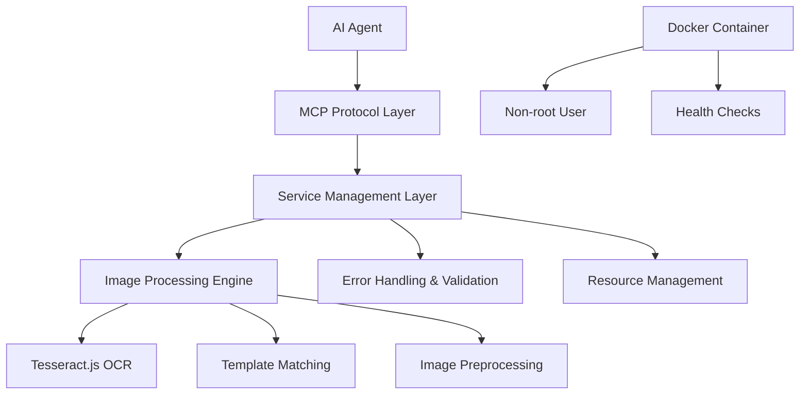

# OCR & CAPTCHA MCP Server 🔍

> 高级 OCR 和验证码识别 MCP 服务器 - 为 AI 代理提供强大的图像识别能力

[](https://github.com/ymeng98/ocr-captcha-mcp-server/actions)
[](https://opensource.org/licenses/MIT)
[](https://nodejs.org/)
[](https://www.docker.com/)

这是一个基于 Model Context Protocol (MCP) 的服务器，为 AI 代理提供 OCR（光学字符识别）和验证码识别功能。支持部署在 [Smithery](https://smithery.ai/) 平台上，使用 Tesseract.js 和先进的图像处理技术。

## ✨ 核心功能

- 🔤 **OCR 文字识别**: 使用 Tesseract.js 提取图片中的文字，支持多语言
- 📍 **文字区域检测**: 智能识别并定位图片中的文字区域和边界框
- 🎨 **图像预处理**: 提供多种图像处理操作提升识别准确率
- 🧩 **滑动验证码解决**: 通过模板匹配找到滑动验证码的正确位置
- 🔒 **安全设计**: 非 root 用户运行，无持久化存储用户图片
- 🚀 **高性能**: 优化的图像处理流水线和内存管理

## 🚀 快速开始

### 在 Smithery 上部署

1. Fork 这个仓库到你的 GitHub 账户
2. 访问 [Smithery](https://smithery.ai/) 并连接你的 GitHub 账户
3. 从你 fork 的仓库部署
4. 在 Claude Desktop 配置中使用提供的 Smithery URL

### 本地开发

```bash
# 克隆仓库
git clone https://github.com/ymeng98/ocr-captcha-mcp-server.git
cd ocr-captcha-mcp-server

# 安装依赖
npm install

# 构建项目
npm run build

# 开发模式运行
npm run dev

# 运行测试
npm test

# 代码检查
npm run lint
```

### Docker 部署

```bash
# 构建镜像
docker build -t ocr-captcha-mcp .

# 运行容器
docker run -p 8080:8080 ocr-captcha-mcp
```

## 🛠️ 可用工具

### `ocr_recognize`
从图片中提取文字内容。

**参数:**
- `image` (必需): Base64 编码的图片数据
- `language` (可选): OCR 语言 (如 "eng", "chi_sim", "eng+chi_sim")
- `psm` (可选): 页面分割模式 (0-13，默认 6)
- `whitelist` (可选): 字符白名单限制

**示例:**
```json
{
  "name": "ocr_recognize",
  "arguments": {
    "image": "iVBORw0KGgoAAAANSUhEU...",
    "language": "eng+chi_sim",
    "whitelist": "0123456789"
  }
}
```

### `text_detection`
检测文字区域并返回边界框信息。

**参数:**
- `image` (必需): Base64 编码的图片数据
- `language` (可选): 检测语言

### `image_preprocessing`
图像预处理以提升 OCR 准确率。

**参数:**
- `image` (必需): Base64 编码的图片数据
- `operations` (可选): 处理操作数组 ['grayscale', 'contrast', 'brightness', 'blur', 'sharpen', 'threshold']
- `threshold` (可选): 二值化阈值 (0-255，默认 128)

### `slide_captcha_match`
通过模板匹配解决滑动验证码。

**参数:**
- `background_image` (必需): 带缺口的背景图片 (Base64)
- `piece_image` (必需): 拼图块图片 (Base64)
- `threshold` (可选): 匹配阈值 (0-1，默认 0.8)

## ⚙️ 配置

### Claude Desktop 配置

本地开发:
```json
{
  "mcpServers": {
    "ocr-captcha": {
      "command": "npx",
      "args": ["tsx", "src/index.ts"],
      "cwd": "/path/to/ocr-captcha-mcp-server"
    }
  }
}
```

Smithery 部署:
```json
{
  "mcpServers": {
    "ocr-captcha": {
      "command": "npx",
      "args": ["-y", "@smithery/cli", "run", "your-deployment-url"]
    }
  }
}
```

## 🏗️ 架构设计



## 📋 系统要求

- Node.js 18+ 
- 内存: 建议 512MB+（用于图像处理）
- Docker（可选，用于容器化部署）
- 支持的图片格式: PNG, JPEG, GIF, BMP

## 🧪 测试

项目包含完整的测试套件：

```bash
# 运行所有测试
npm test

# 测试 MCP 协议通信
node test-protocol.cjs

# 简单功能测试
node simple-test.cjs

# TypeScript 完整测试
npm run dev -- test-mcp.ts
```

## 🔒 安全特性

- ✅ Docker 容器中使用非 root 用户运行
- ✅ 输入参数严格验证
- ✅ 完善的错误处理机制
- ✅ 不持久化存储用户图片
- ✅ 内存使用优化和垃圾回收

## 🤝 贡献指南

1. Fork 这个仓库
2. 创建功能分支 (`git checkout -b feature/AmazingFeature`)
3. 提交你的更改 (`git commit -m 'Add some AmazingFeature'`)
4. 推送到分支 (`git push origin feature/AmazingFeature`)
5. 开启 Pull Request

## 📄 开源协议

本项目基于 MIT 协议开源 - 查看 [LICENSE](LICENSE) 文件了解详情。

## 🙏 致谢

- [Tesseract.js](https://tesseract.projectnaptha.com/) - 强大的 OCR 引擎
- [Model Context Protocol](https://modelcontextprotocol.io/) - AI 代理通信协议
- [Smithery](https://smithery.ai/) - AI 服务部署平台
- [Sharp](https://sharp.pixelplumbing.com/) - 高性能图像处理库

## 📞 支持

如有问题或建议：
- 查看 [GitHub Issues](https://github.com/ymeng98/ocr-captcha-mcp-server/issues)
- 参考 [MCP 文档](https://modelcontextprotocol.io/docs)
- 访问 [Smithery 文档](https://smithery.ai/docs)

---

<div align="center">
  <strong>🌟 如果这个项目对你有帮助，请给它一个 Star！</strong>
</div>